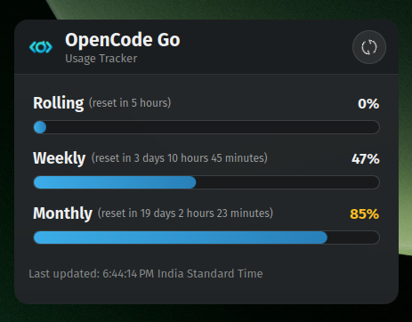
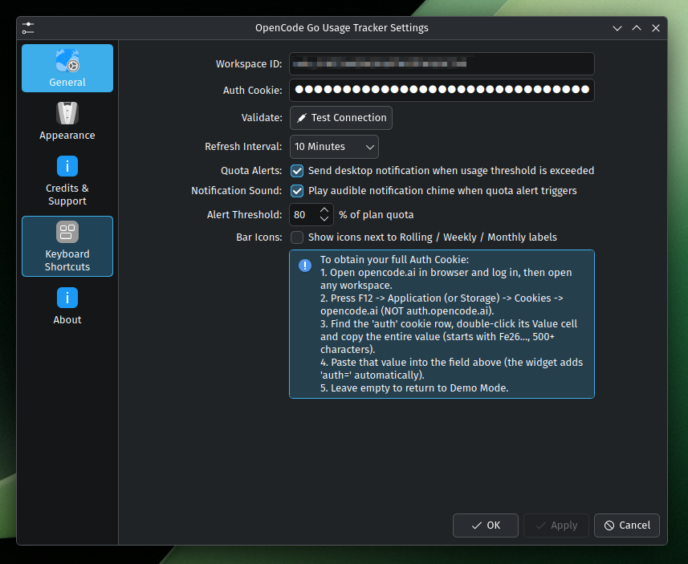

<!-- © Mayanktaker Computers & Web Development | https://mayanktaker.com -->
# 📊 OpenCode Go Usage Tracker — KDE Plasma 6 Plasmoid & CLI Utility

[](https://kde.org)
[](https://www.qt.io/)
[](LICENSE)

A compact **KDE Plasma 6** widget and companion command-line utility for tracking your **OpenCode Go** subscription usage across **Rolling (5h)**, **Weekly**, and **Monthly** windows — right from your desktop panel.

---

## 📸 Screenshots

| Light Theme | Settings | Dark Theme |
|:---:|:---:|:---:|
|  |  |  |

---

## 🌟 Key Features

- 🎨 **Redesigned Brand Logo (`<O✦>`)**: Custom cyan-teal vector logo combining code brackets `< >`, central ring `O`, and glowing spark `✦`, integrated seamlessly across panel icons, header containers, SVGs, and system theme icon sizes (16px–128px).
- 📊 **Real-Time Usage Tracking**: Fetches live data from the OpenCode Console JSON API `opencode.ai/console/api/internal/orgs/{orgId}/go/status` via `curl` (Qt's QML XHR strips the Cookie header). Shows Rolling (5h)/Weekly/Monthly usage percentages with reset countdowns. The fetch walks a candidate route list and retries the next path whenever a route answers HTTP 404 (empty body = route moved), so a future server-side rename costs one retry instead of a hard failure; if every candidate 404s it reports "OpenCode Console API route not found — check for a widget update", while a 401 still means the auth session expired.
- ⏱️ **Per-Window Reset Countdowns**: Natural-language `(reset in 3 hours 45 minutes)` brackets next to Rolling (5h)/Weekly/Monthly labels — toggleable from settings, shown with real API reset data (demo data included).
- 📐 **Horizontal Progress Bars**: Compact horizontal bars with animated cyan fills, percentage highlights, and hover tooltips showing detailed stats.
- 🖼️ **Full-Bleed Header**: Distinct header title section spanning the widget's full width with configurable `headerBackgroundColor`, top corners matched to the card radius, and a 1px hairline divider.
- 🔄 **Animated Circular Refresh**: Interactive refresh button with smooth hover scale pulse and continuous rotation animation while data fetching is active.
- 🏷️ **Dynamic Panel Badge**: Real-time percentage badge on the taskbar icon with automatic color shifts:
  - `< 75%`: Configured theme accent color
  - `75% - 89%`: Warning Orange (`#ffb86c`)
  - `≥ 90%`: Critical Red (`#ff5555`)
- 🔔 **Native KDE Desktop Alerts**: System notification toasts when usage crosses your configured threshold (e.g., 80%) or when auth session cookies expire.
- 🎨 **12 Developer Theme Presets**: Catppuccin Mocha (default), Breeze Dark, Nord, Dracula, Solarized, Gruvbox, Tokyo Night, One Dark, plus 4 light themes. Full custom color pickers including background, header background, text, bar primary/secondary, and accent colors.
- 💻 **Global CLI Utility (`opencode-usage`)**: Terminal access with formatted output, JSON mode (`--json`), CSV export (`--export`), and Bash/Zsh tab completions.
- 📦 **Open Source**: Full source, issue tracker, and releases on [GitHub](https://github.com/Mayanktaker/OpencodeGo-KDE) — linked with icons right from the widget's About page.

---

## 🖥️ System Requirements

| Component | Minimum | Recommended |
| :--- | :--- | :--- |
| **OS** | Fedora 39+, Arch, Ubuntu 24.04+, openSUSE | Any modern Linux with KDE |
| **Desktop** | KDE Plasma 6.0+ | KDE Plasma 6.5.x+ |
| **Qt** | Qt 6.5+ | Qt 6.7+ |
| **Dependencies** | `kpackagetool6`, `curl` | Pre-installed on KDE Plasma 6 |

---

## 🚀 Installation

```bash
git clone https://github.com/mayanktaker/OpencodeGo-KDE.git
cd OpencodeGo-KDE
./install.sh
```

This automatically:
1. Installs/upgrades the plasmoid to `~/.local/share/plasma/plasmoids/`
2. Registers custom icons in `~/.local/share/icons/hicolor/`
3. Purges QML caches and restarts `plasmashell`
4. Links `opencode-usage` CLI to `~/.local/bin/`
5. Installs Bash tab completions

---

## 📦 Download & Releases

Prefer a ready-made bundle? Grab the latest `.plasmoid` package or the shareable `.zip` (includes the installer + CLI) from the [GitHub Releases page](https://github.com/Mayanktaker/OpencodeGo-KDE/releases). Install a downloaded `.plasmoid` with:

```bash
kpackagetool6 -t Plasma/Applet -i com.mayanktaker.opencodego-usage-v2.3.0.plasmoid
```

---

## 🔑 How to Get Your Workspace ID & Auth Cookie

1. Open the OpenCode Console Go page: `https://opencode.ai/console/wrk_XXXXXXXX/go` (sign in if prompted). Use the console — `/usage` is a separate cost dashboard, not the Go usage page.
2. Copy the workspace ID from the browser URL bar (it starts with `wrk_`, e.g. `wrk_01KE20AQRQ9QR7N15TWGJBE2V9`; `org_...` ids work too).
3. Press `F12` → **Application** → **Cookies** → `opencode.ai`.
4. Copy the `auth` cookie value (starts with `Fe26.2**`, 500+ characters).
5. Right-click the widget → **Configure** → paste **Workspace ID** and **Auth Cookie**.
6. Click **Apply** or **OK**.
---

## 💻 CLI Usage

```bash
# Display formatted usage stats
opencode-usage

# Output raw JSON
opencode-usage --json

# Export to CSV
opencode-usage --export /tmp/usage.csv

# Force demo mode
opencode-usage --demo

# Custom credentials
opencode-usage -w "wrk_01KE20AQRQ9QR7N15TWGJBE2V9" -c "auth_token"
```

---

## 📁 Project Structure

```
OpencodeGo-KDE/
├── metadata.json
├── contents/
│   ├── config/
│   │   ├── config.qml
│   │   └── main.xml
│   ├── ui/
│   │   ├── main.qml                 # Root PlasmoidItem, timer, data flow
│   │   ├── CompactRepresentation.qml # Panel tray badge
│   │   ├── FullRepresentation.qml   # Expanded popup
│   │   ├── UsageHeader.qml          # Title, refresh, full-bleed stripe
│   │   ├── HorizontalUsageBars.qml  # Progress bars + reset brackets
│   │   ├── UsageBarChart.qml        # Bar chart component
│   │   ├── UsageFetcher.qml         # curl transport via executable engine
│   │   ├── ViewSelector.qml         # (disabled) tab bar
│   │   ├── configGeneral.qml        # Settings: workspace, cookie, Test button
│   │   ├── configAppearance.qml     # Theme presets, toggles & color pickers
│   │   └── configAbout.qml          # Credits, GitHub repo & support
│   └── code/
│       └── api.js                   # Parsing, shell-quote, curl builder
├── bin/
│   ├── opencode-usage               # Python CLI client
│   ├── opencode-usage-completion.bash
│   └── opencode-usage-completion.zsh
├── assets/
│   ├── icon.svg
│   └── branding-icon.jpg
├── .github/
│   └── workflows/
│       └── release.yml              # CI: build + publish release bundles
├── install.sh
├── install-cli.sh
├── LICENSE
└── README.md
```

---

## 🏗️ Architecture Notes

- **Network Transport**: Qt's QML XHR silently strips the `Cookie` header (Qt `CookieLoadControlAttribute`), so `UsageFetcher.qml` shells out to `curl` via Plasma's `executable` dataengine. The cookie is shell-quoted before inlining.
- **Data Parsing**: `api.js` parses the console `go/status` JSON response (`access.meters.fiveHour` / `week` / `month`, BigInt money fields as strings), converting each meter into a percentage, reset countdown, and progress bar.
- **QML Bindings**: Child components must qualify parent properties with the parent's `id` (e.g., `fullRoot.usagePercent`) — unqualified names resolve to the child's own property, creating silent self-binding loops.

---

## ⚖️ License & Copyright

© [Mayanktaker Computers & Web Development](https://mayanktaker.com) — Licensed under [MIT](LICENSE).
