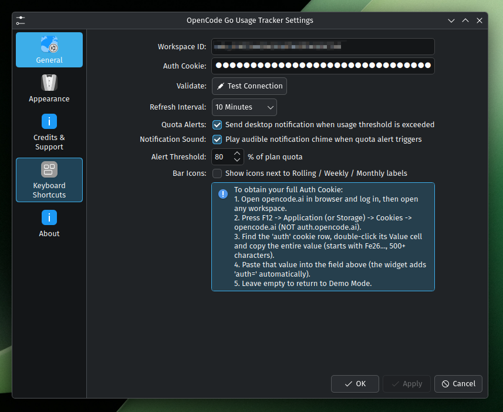
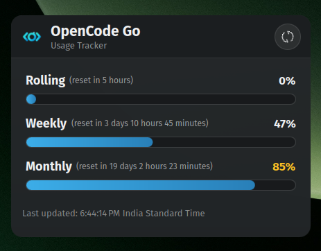

<!-- © Mayanktaker Computers & Web Development | https://mayanktaker.com -->
# 📊 OpenCode Go Usage Tracker — KDE Plasma 6 Plasmoid & CLI Utility

[](https://kde.org)
[](https://www.qt.io/)
[](LICENSE)

A compact **KDE Plasma 6** widget and companion command-line utility for tracking your **OpenCode Go** subscription usage across **Rolling (5h)**, **Weekly**, and **Monthly** windows — right from your desktop panel.

---

## 📸 Screenshots

| Light Theme | Settings | Dark Theme |
|:---:|:---:|:---:|
|  |  |  |

---

## 🌟 Key Features

- 🎨 **Redesigned Brand Logo (`<O✦>`)**: Custom cyan-teal vector logo combining code brackets `< >`, central ring `O`, and glowing spark `✦`, integrated seamlessly across panel icons, header containers, SVGs, and system theme icon sizes (16px–128px).
- 📊 **Real-Time Usage Tracking**: Fetches live data from the OpenCode Console JSON API `opencode.ai/console/api/go/status` via `curl` (Qt's QML XHR strips the Cookie header). The workspace ID travels in the required `x-org-id` header — it is **not** part of the path. Shows Rolling (5h)/Weekly/Monthly usage percentages with reset countdowns. The fetch walks a candidate route list and retries the next path whenever a route answers HTTP 404 (empty body = route moved), so a future server-side rename costs one retry instead of a hard failure; a transient HTTP 5xx is retried in place (plasmoid up to 4 attempts, CLI up to 3) and then reports "Console API temporarily unavailable (HTTP 5xx) — retry shortly" (the endpoint is currently intermittent); if every candidate 404s it reports "OpenCode Console API route not found — check for a widget update", while a 401 still means the auth session expired.
- ⏱️ **Per-Window Reset Countdowns**: Natural-language `(reset in 3 hours 45 minutes)` brackets next to Rolling (5h)/Weekly/Monthly labels — toggleable from settings, shown with real API reset data (demo data included).
- 📐 **Horizontal Progress Bars**: Compact horizontal bars with animated cyan fills, percentage highlights, and hover tooltips showing detailed stats.
- 🖼️ **Full-Bleed Header**: Distinct header title section spanning the widget's full width with configurable `headerBackgroundColor`, top corners matched to the card radius, and a 1px hairline divider.
- 🔄 **Animated Circular Refresh**: Interactive refresh button with smooth hover scale pulse and continuous rotation animation while data fetching is active.
- 🏷️ **Dynamic Panel Badge**: Real-time percentage badge on the taskbar icon with automatic color shifts:
  - `< 75%`: Configured theme accent color
  - `75% - 89%`: Warning Orange (`#ffb86c`)
  - `≥ 90%`: Critical Red (`#ff5555`)
- 🔔 **Native KDE Desktop Alerts**: System notification toasts when usage crosses your configured threshold (e.g., 80%) or when auth session cookies expire.
- 🎨 **12 Developer Theme Presets**: Catppuccin Mocha (default), Breeze Dark, Nord, Dracula, Solarized, Gruvbox, Tokyo Night, One Dark, plus 4 light themes. Full custom color pickers including background, header background, text, bar primary/secondary, and accent colors.
- 💻 **Global CLI Utility (`opencode-usage`)**: Terminal access with formatted output, JSON mode (`--json`), CSV export (`--export`), and Bash/Zsh tab completions.
- 🧾 **Stale-Figures Fallback**: When the console has a brief outage, the widget keeps your last known numbers on screen with a "showing last known figures" note instead of going blank.
- 📦 **Open Source**: Full source, issue tracker, and releases on [GitHub](https://github.com/Mayanktaker/OpencodeGo-KDE) — linked with icons right from the widget's About page.

---

## 🖥️ System Requirements

| Component | Minimum | Recommended |
| :--- | :--- | :--- |
| **OS** | Fedora 39+, Arch, Ubuntu 24.04+, openSUSE | Any modern Linux with KDE |
| **Desktop** | KDE Plasma 6.0+ | KDE Plasma 6.5.x+ |
| **Qt** | Qt 6.5+ | Qt 6.7+ |
| **Dependencies** | `kpackagetool6`, `curl` | Pre-installed on KDE Plasma 6 |

---

## 🚀 Installation

```bash
git clone https://github.com/mayanktaker/OpencodeGo-KDE.git
cd OpencodeGo-KDE
./install.sh
```

This automatically:
1. Installs/upgrades the plasmoid to `~/.local/share/plasma/plasmoids/`
2. Registers custom icons in `~/.local/share/icons/hicolor/`
3. Purges QML caches and restarts `plasmashell`
4. Links `opencode-usage` CLI to `~/.local/bin/`
5. Installs Bash tab completions

---

## 🐧 GNOME Shell Extension

The same usage tracker also ships as a GNOME Shell panel extension (UUID `com.mayanktaker.opencodego-usage`, GNOME Shell 46–50):

```bash
bash gnome-extension/install.sh
```

- Hover the panel icon to see Rolling (5h)/Weekly/Monthly usage; without credentials it shows demo data.
- The panel shows the weekly percentage next to the icon — orange at 75%, red at 90%. Switch it off in settings if you prefer icon only.
- The popup ends with **Open OpenCode Console** and **Settings…** — both stay available even when your sign-in has expired.
- The panel now shows the O✦ logo on GNOME too, not just on KDE.
- Open the extension's preferences (`gnome-extensions prefs com.mayanktaker.opencodego-usage`) and paste your Workspace ID + Auth Cookie to switch to live figures. **Test** checks your details without waiting for a refresh.
- On Wayland, the first install needs a logout/login: a running shell never picks up a newly installed extension. The installer queues it so it comes up enabled automatically.

### Installing on Manjaro / Arch

```bash
# 1. install (from a clone, or from the gnome-extension/ folder of a release bundle)
bash gnome-extension/install.sh

# 2. log out and back in  — required on Wayland, there is no rescan

# 3. confirm it is running
gnome-extensions info com.mayanktaker.opencodego-usage | grep -E 'State|Enabled'
journalctl --user -b | grep -i opencodego        # should be quiet

# 4. add your details
gnome-extensions prefs com.mayanktaker.opencodego-usage
```

Step 1 copies the extension into `~/.local/share/gnome-shell/extensions/com.mayanktaker.opencodego-usage`, compiles its gsettings schema, and queues it in dconf so it comes up enabled after the logout.

Getting the two values for step 4: open `https://opencode.ai/console/<your-workspace>/go` in the browser, then DevTools → Application → Cookies → opencode.ai → `__Host-console_session` for the cookie, and the `wrk_…` in the address bar for the workspace id. Paste them in and press **Test**.

Updating later: re-run `bash gnome-extension/install.sh` and log out/in again — a running shell keeps the old code.

To remove it:

```bash
gnome-extensions disable com.mayanktaker.opencodego-usage   # if the shell knows it
rm -rf ~/.local/share/gnome-shell/extensions/com.mayanktaker.opencodego-usage
dconf write /org/gnome/shell/enabled-extensions "['gnome-shell-extensions-appindicator@ubuntu.com']"  # keep your other extensions
```

---

## 📦 Download & Releases

Prefer a ready-made bundle? Grab the latest `.plasmoid` package or the shareable `.zip` (includes the installer + CLI) from the [GitHub Releases page](https://github.com/Mayanktaker/OpencodeGo-KDE/releases). Install a downloaded `.plasmoid` with:

```bash
kpackagetool6 -t Plasma/Applet -i com.mayanktaker.opencodego-usage-v*.plasmoid
```

---

## 🔑 How to Get Your Workspace ID & Auth Cookie

1. Open the OpenCode Console Go page: `https://opencode.ai/console/wrk_XXXXXXXX/go` (sign in if prompted). Use the console — `/usage` is a separate cost dashboard, not the Go usage page.
2. Copy the workspace ID from the browser URL bar (it starts with `wrk_`, e.g. `wrk_01KE20AQRQ9QR7N15TWGJBE2V9`; `org_...` ids work too). It is sent in the `x-org-id` header on every request.
3. Press `F12` → **Application** → **Cookies** → `opencode.ai`.
4. Copy the **`__Host-console_session`** cookie value (a short opaque token, ~39 characters, e.g. `st_...`) — **not** `auth`. The old iron-session `auth=Fe26.2**` cookie no longer authenticates the console.
5. Right-click the widget → **Configure** → paste **Workspace ID** and the cookie value.
6. Click **Apply** or **OK**.
---

## 💻 CLI Usage

```bash
# Display formatted usage stats
opencode-usage

# Output raw JSON
opencode-usage --json

# Export to CSV
opencode-usage --export /tmp/usage.csv

# Force demo mode
opencode-usage --demo

# Custom credentials
opencode-usage -w "wrk_01KE20AQRQ9QR7N15TWGJBE2V9" -c "__Host-console_session=st_..."
```

---

## 📁 Project Structure

```
OpencodeGo-KDE/
├── metadata.json
├── contents/
│   ├── config/
│   │   ├── config.qml
│   │   └── main.xml
│   ├── ui/
│   │   ├── main.qml                 # Root PlasmoidItem, timer, data flow
│   │   ├── CompactRepresentation.qml # Panel tray badge
│   │   ├── FullRepresentation.qml   # Expanded popup
│   │   ├── UsageHeader.qml          # Title, refresh, full-bleed stripe
│   │   ├── HorizontalUsageBars.qml  # Progress bars + reset brackets
│   │   ├── UsageBarChart.qml        # Bar chart component
│   │   ├── UsageFetcher.qml         # curl transport via executable engine
│   │   ├── ViewSelector.qml         # (disabled) tab bar
│   │   ├── configGeneral.qml        # Settings: workspace, cookie, Test button
│   │   ├── configAppearance.qml     # Theme presets, toggles & color pickers
│   │   └── configAbout.qml          # Credits, GitHub repo & support
│   └── code/
│       └── api.js                   # Parsing, shell-quote, curl builder
├── bin/
│   ├── opencode-usage               # Python CLI client
│   ├── opencode-usage-completion.bash
│   └── opencode-usage-completion.zsh
├── gnome-extension/
│   ├── metadata.json                # Extension manifest (GNOME Shell 46–50)
│   ├── extension.js                 # Panel indicator, async curl transport, timer
│   ├── popup.js                     # Hover popup: header, 3 usage bars, footer
│   ├── settings.js                  # gsettings schema resolution + key names
│   ├── prefs.js                     # libadwaita preferences page
│   ├── api.js                       # GJS port of contents/code/api.js
│   ├── schemas/                     # gsettings schema (compiled on install)
│   ├── icons/                       # Branded O✦ logo (not yet wired to the panel)
│   ├── tests/                       # gjs test suites + runner
│   └── install.sh                   # Install, compile schema, enable or queue
├── assets/
│   ├── icon.svg
│   └── branding-icon.jpg
├── .github/
│   └── workflows/
│       └── release.yml              # CI: build + publish release bundles
├── install.sh
├── install-cli.sh
├── LICENSE
└── README.md
```

---

## 🏗️ Architecture Notes

- **Network Transport**: Qt's QML XHR silently strips the `Cookie` header (Qt `CookieLoadControlAttribute`), so `UsageFetcher.qml` shells out to `curl` via Plasma's `executable` dataengine. The cookie is shell-quoted before inlining.
- **Data Parsing**: `api.js` parses the console `go/status` JSON response (`access.meters.fiveHour` / `week` / `month`, BigInt money fields as strings), converting each meter into a percentage, reset countdown, and progress bar.
- **QML Bindings**: Child components must qualify parent properties with the parent's `id` (e.g., `fullRoot.usagePercent`) — unqualified names resolve to the child's own property, creating silent self-binding loops.

---

## ✨ What's New in v2.5.0

- **Now on GNOME Shell as well as KDE Plasma** — a panel icon that shows your Rolling (5h), Weekly, and Monthly usage on hover, with its own settings window.
- The GNOME panel icon now uses the same O✦ logo as the KDE widget, and shows your weekly percentage next to it (orange at 75%, red at 90%) — switch the badge off in settings if you prefer icon only.
- The GNOME popup has **Open OpenCode Console** and **Settings…** entries, and they still work when your sign-in has expired.
- GNOME settings include a **Test** button that checks your details straight away.
- The GNOME panel icon shows up reliably after a fresh install instead of silently not appearing.
- The GNOME settings window opens its contents properly.
- During a brief OpenCode outage, GNOME keeps your last known figures instead of replacing them with an error.
- The GNOME popup no longer duplicates itself after a refresh.
- GNOME no longer waits on the network in the background, so the desktop stays responsive while usage is checked.
- The download bundle now includes the GNOME extension, and builds always pick up the current version number.
- Full release notes live in [CHANGELOG.md](CHANGELOG.md).

---

## ⚠️ Known Issue: Brief "Temporarily Unavailable" Messages

OpenCode's usage page itself sometimes answers with a short outage (even in a browser). The widget retries automatically and keeps your last numbers on screen, then picks up fresh numbers on the next refresh — no action needed. If you see it often, you can report it to OpenCode with this template:

> Subject: `GET /console/api/go/status` returns intermittent HTTP 500
> Body: "While signed in, `GET https://opencode.ai/console/api/go/status` (with `x-org-id`) intermittently returns `500 {\"_tag\":\"InternalServerError\"}` — roughly 6 of 8 tries during one window — while `/console/api/orgs` stays 200. Seen on 2026-09-18. Please investigate."

## ⚖️ License & Copyright

© [Mayanktaker Computers & Web Development](https://mayanktaker.com) — Licensed under [MIT](LICENSE).
